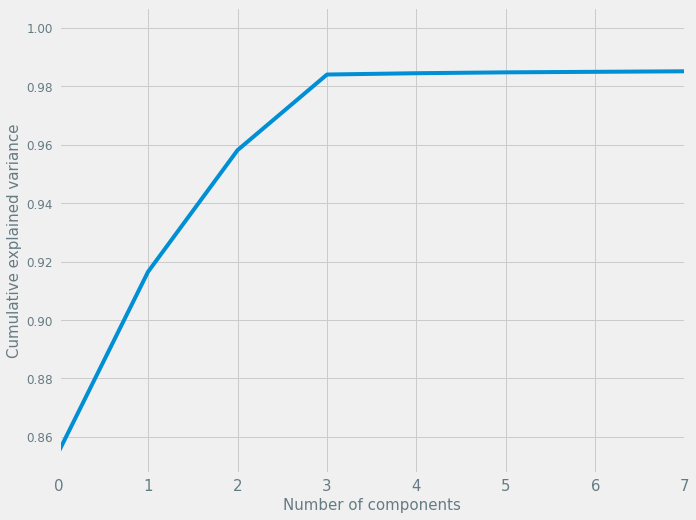
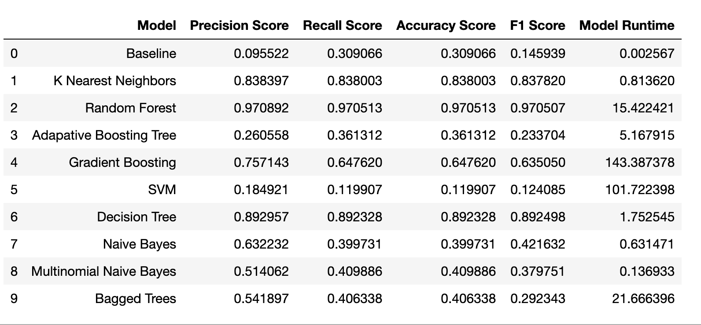
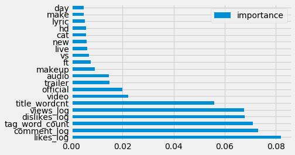
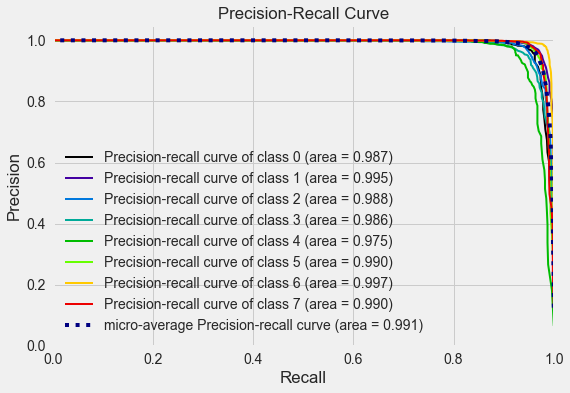

# Mod5
Youtube API + Classifier on categories
## Goal
Build a classifier that predict category of a given yotube information to one of the following categories: 
Gaming/Sports, Entertainment, Films, Music, lifestyle and travel, STEM.

## Variables
- number of total likes
- number of total dislikes
- number of views
- number of comments
- length of the video title per word
- number of tags

- Qualitative: title words

## Data Preprocessing / Feature Engineering
I used NLTK package in python to tokenize, lemmatize and filter the titles, giving us 4000 unique features (words). From there I vectorized the data via TF-IDF calculation and dropped words below a threshold of 0.001, which left me with around 354 words to model.

## Visualization of Data in Reduced Dimensions

## Results- Performance of the models

# Some feature imporance

## Precision and Call curve 

Although I checked for imbalanced problems, I want to show the accuracy of the model, effect size of the model using Precision and recall which is more precisive than ROC curve.

## Result
![header]let us go with the grid searched random forest with entropy criterion, max depth 5, it turns out, there is a strong indication on the role of number of likes, comments and length of the tags on the classifications of the video categories. 

Mean Cross Validation Score for Random Forest Classifier: 94.16% and 83.67% for decision tree baseline models.
I tuned hyperparameters in random forest model and get the optimal Parameters: {'criterion': 'gini', 'max_depth': None, 'min_samples_leaf': 3, 'min_samples_split': 5, 'n_estimators': 100}.The final accuracy F1 score is 82% using grid search gini criterion. 
